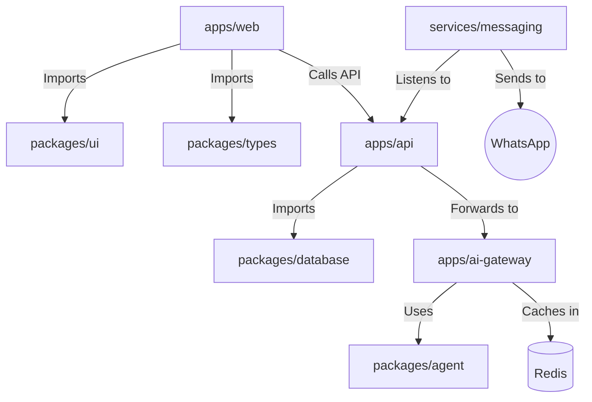

# 🏗️ NIAGAOS BLUEPRINT & MIGRATION MAP

> **IMMUTABLE SPECIFICATION**
> This document defines the **ONLY** allowed structure for the NiagaHub One project.
> Any deviation from this blueprint requires manual approval from the Chief Architect.

---

## 1. 🗺️ THE FOUR PILLARS (REFERENCE SOURCES)

Do not modify these sources. Copy from them.

| ID | Source Name | Path | Role | Content to Harvest |
|----|-------------|------|------|--------------------|
| **S1** | `niagahub-startupos` | `g:\NIAGAHUB-MAIN\niagahub-startupos` | **The Body** | UI Modules (HR, Finance), Pages, Dashboard Layout. |
| **S2** | `clawd` | `g:\NIAGAHUB-MAIN\clawd` | **The Soul** | NiagaBot Persona, 27 AI Skills, Memory Logic. |
| **S3** | `NiagaHub-SuperApp` | `g:\NIAGAHUB-MAIN\NiagaHub-SuperApp` | **The Brain** | MCP Server, Redis Cache, Circuit Breaker Logic. |
| **S4** | `NIAGA-HUB-APPS` | `g:\NIAGAHUB-MAIN\NIAGA-HUB-APPS` | **The Face** | Kiosk App (Voice), Mobile App (Loyalty), WOCS Server. |

---

## 2. 📍 MIGRATION MAPPING (FROM -> TO)

### A. The Unified Dashboard (Web)

**Target:** `g:\NIAGAHUB-MAIN\niagaos\apps\web`

- **Base:** React 19 + Vite (Fresh Scaffold).
- **Modules (From S1):**
  - `S1/pages/Dashboard.tsx` -> `apps/web/src/pages/dashboard/index.tsx`
  - `S1/pages/finance/*` -> `apps/web/src/modules/finance/*`
  - `S1/pages/hr/*` -> `apps/web/src/modules/hr/*`
  - `S1/components/*` -> `packages/ui/src/components/*` (Refactor to shared UI)

### B. The AI Brain (Gateway)

**Target:** `g:\NIAGAHUB-MAIN\niagaos\apps\ai-gateway`
**Source:** `S3/notebookllm-mcp`

- **Action:** Copy `index.ts`, `redisManager.ts`, `websocket.ts`.
- **Adaptation:** Convert to Express middleware compatible with `niagaos` types.

### C. The Agent Logic (Skills)

**Target:** `g:\NIAGAHUB-MAIN\niagaos\packages\agent`
**Source:** `S2/skills`

- **Action:** Copy all 27 skill folders.
- **Refactor:** Create `index.ts` in each skill folder to export an MCP-compatible Tool definition.

### D. The Messaging Engine

**Target:** `g:\NIAGAHUB-MAIN\niagaos\services\messaging`
**Source:** `S4/apps/wocs-server`

- **Action:** Copy `executors/`, `queues/`, `webhooks/`.
- **Integration:** Connect to `packages/database` instead of local JSON files.

---

## 3. 🚧 STRICT PRESERVATION LAWS

### Law #1: The "No-Ghost" Rule

No "ghost" code. Every file in `niagaos` must be traceable to one of the 4 Source Pillars.

- Do not invent new features.
- Do not run `npm install` for random packages without checking `package.json` in Source Pillars first.

### Law #2: The "One DB" Rule

There is only ONE database: **Supabase (PostgreSQL)**.

- **S1** (StartupOS) used dummy data -> **FAIL**.
- **S4** (SuperApp) used localStorage -> **FAIL**.
- **Unified Rule:** All entities must be defined in `packages/database/prisma/schema.prisma`.

### Law #3: The "Brain Drain" Rule

Do not put complex logic in the Frontend.

- **Frontend** = Display Data & Capture Input.
- **Backend/AI** = Process Logic.
- **Example:** Calculating Payroll happens in `services/payroll` (or via AI), NOT in `PayrollPage.tsx`.

---

## 4. 🔗 MODULE BOUNDARIES

