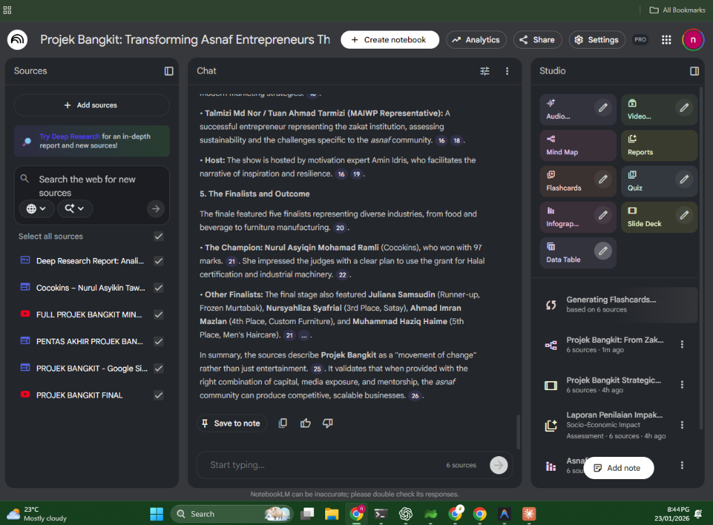
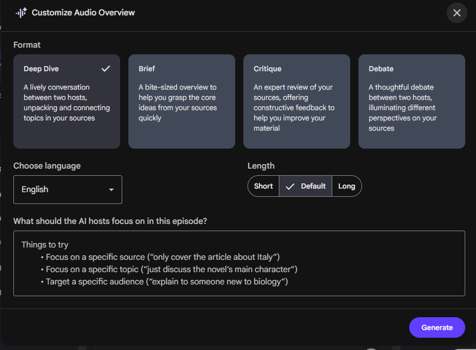
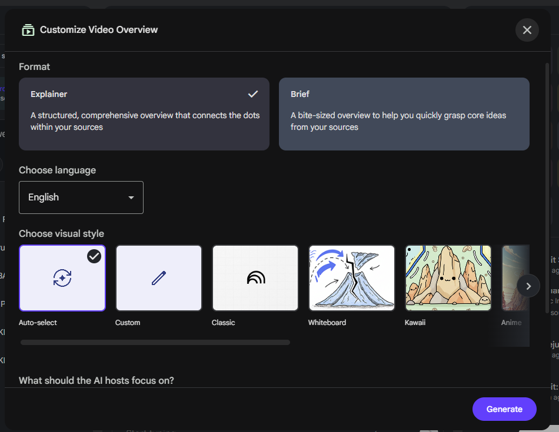
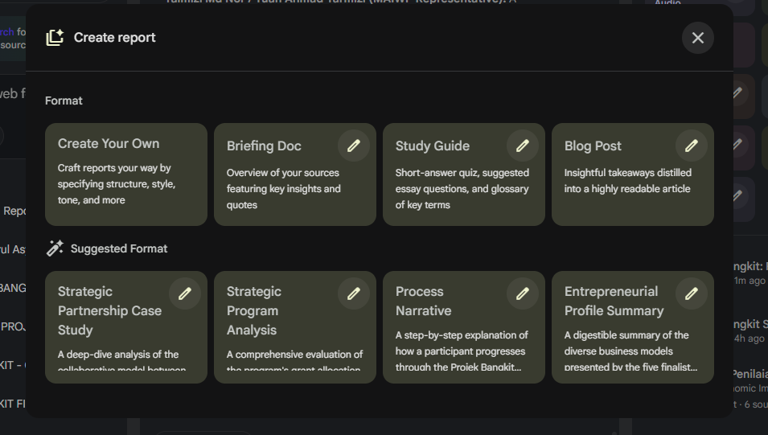
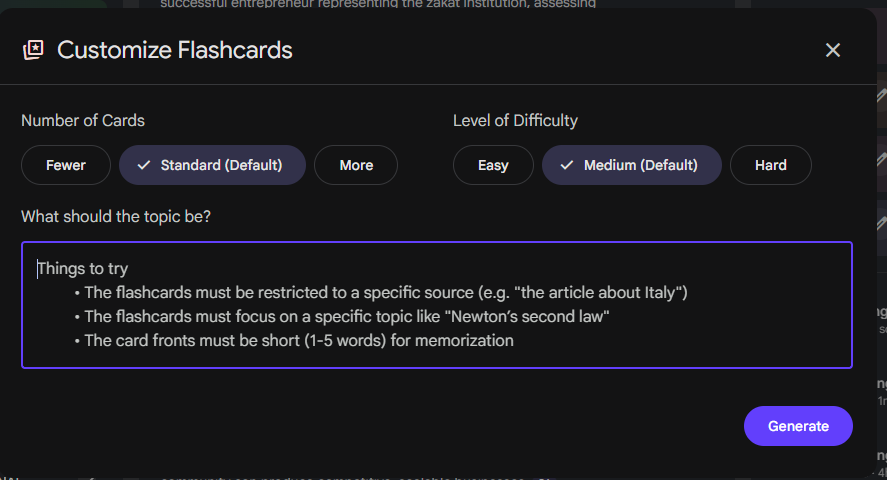
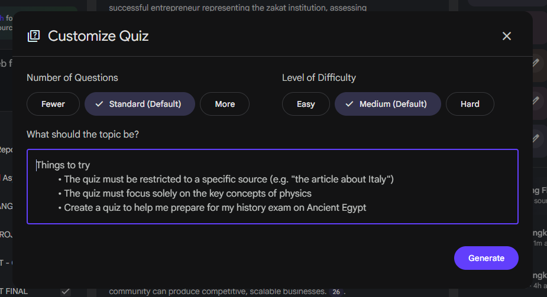
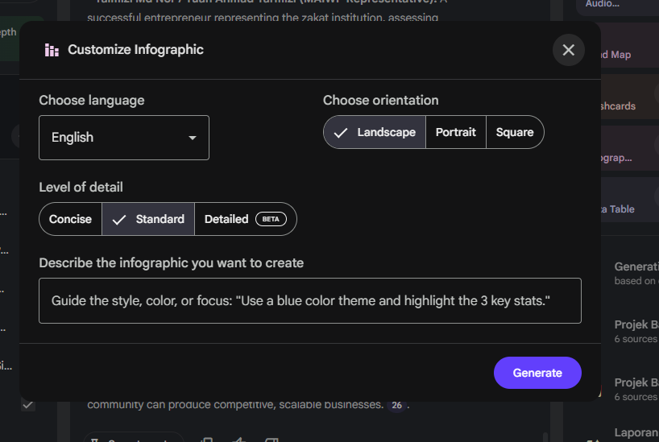
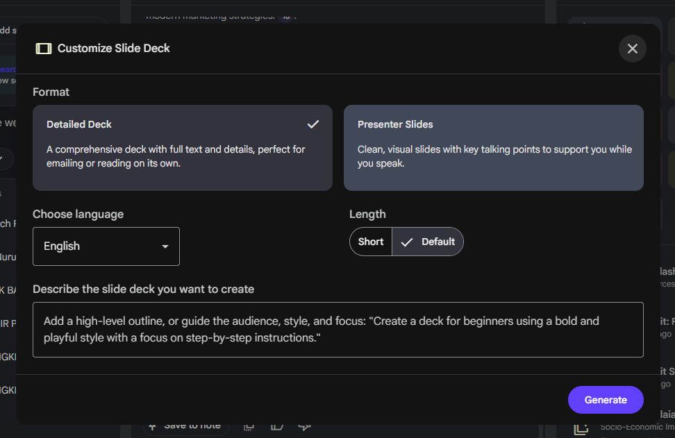
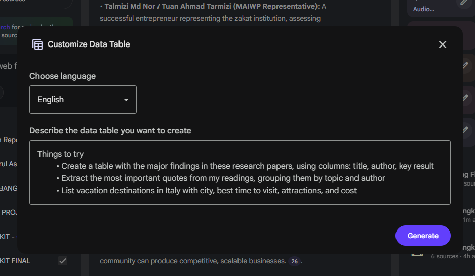

# NotebookLLM UI Reference

This document provides UI screenshots and selector mappings for the NotebookLLM Chrome Extension MCP integration.

## Main Interface



**Panels:**

- **Sources** (left): Add sources, search, source list
- **Chat** (center): Conversation with AI, input at bottom
- **Studio** (right): Audio, Video, Mind Map, Reports, Flashcards, Quiz, Infographic, Slide Deck, Data Table

---

## Studio Dialogs

### Audio Overview



| Element | Options |
|---------|---------|
| **Format** | Deep Dive ✓, Brief, Critique, Debate |
| **Language** | Dropdown (English) |
| **Length** | Short, Default ✓, Long |
| **Focus** | Textarea |
| **Action** | Generate button |

---

### Video Overview



| Element | Options |
|---------|---------|
| **Format** | Explainer ✓, Brief |
| **Language** | Dropdown (English) |
| **Visual Style** | Auto-select ✓, Custom, Classic, Whiteboard, Kawaii, Anime |
| **Focus** | Textarea |
| **Action** | Generate button |

---

### Create Report



| Element | Options |
|---------|---------|
| **Format** | Create Your Own, Briefing Doc, Study Guide, Blog Post |
| **Suggested** | Strategic Partnership Case Study, Strategic Program Analysis, Process Narrative, Entrepreneurial Profile Summary |
| **Action** | Generate button |

---

### Flashcards



| Element | Options |
|---------|---------|
| **Number of Cards** | Fewer, Standard (Default) ✓, More |
| **Level of Difficulty** | Easy, Medium (Default) ✓, Hard |
| **Topic** | Textarea |
| **Action** | Generate button |

---

### Quiz



| Element | Options |
|---------|---------|
| **Number of Questions** | Fewer, Standard (Default) ✓, More |
| **Level of Difficulty** | Easy, Medium (Default) ✓, Hard |
| **Topic** | Textarea |
| **Action** | Generate button |

---

### Infographic



| Element | Options |
|---------|---------|
| **Language** | Dropdown (English) |
| **Orientation** | Landscape ✓, Portrait, Square |
| **Level of Detail** | Concise, Standard ✓, Detailed (BETA) |
| **Description** | Textarea |
| **Action** | Generate button |

---

### Slide Deck



| Element | Options |
|---------|---------|
| **Format** | Detailed Deck ✓, Presenter Slides |
| **Language** | Dropdown (English) |
| **Length** | Short, Default ✓ |
| **Description** | Textarea |
| **Action** | Generate button |

---

### Data Table



| Element | Options |
|---------|---------|
| **Language** | Dropdown (English) |
| **Description** | Textarea |
| **Action** | Generate button |

---

## CSS Selector Reference

Based on the UI analysis, these are the key selectors:

```javascript
// Dialog buttons (all have purple Generate button)
generateBtn: 'button:has-text("Generate")'

// Format cards (clickable cards in dialogs)
formatCard: '[class*="format"], [class*="card"]'

// Language dropdown
languageDropdown: 'button:has-text("English")'

// Length/Count options (button groups)
lengthButtons: 'button:has-text("Short"), button:has-text("Default"), button:has-text("Long")'
countButtons: 'button:has-text("Fewer"), button:has-text("Standard"), button:has-text("More")'
difficultyButtons: 'button:has-text("Easy"), button:has-text("Medium"), button:has-text("Hard")'

// Visual style cards (Video Overview)
visualStyleCards: '[class*="style"]'

// Textarea inputs
topicInput: 'textarea[placeholder*="topic"]'
focusInput: 'textarea[placeholder*="focus"]'
descriptionInput: 'textarea[placeholder*="Describe"]'
```
